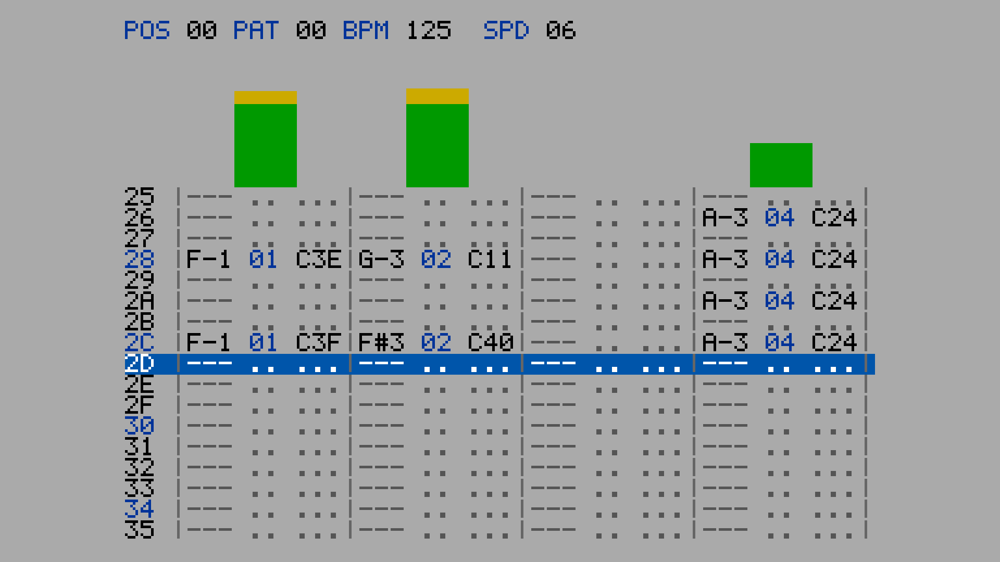
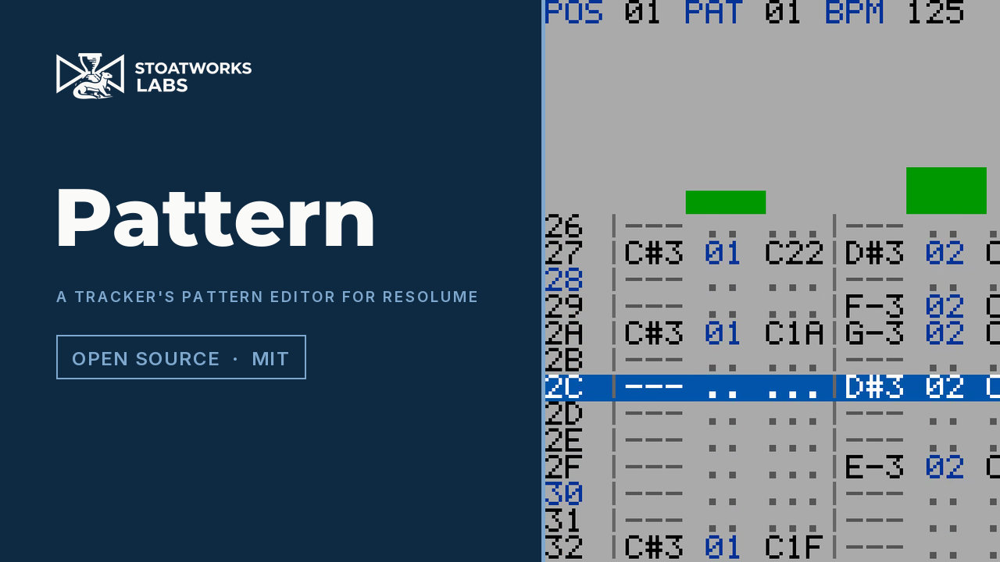
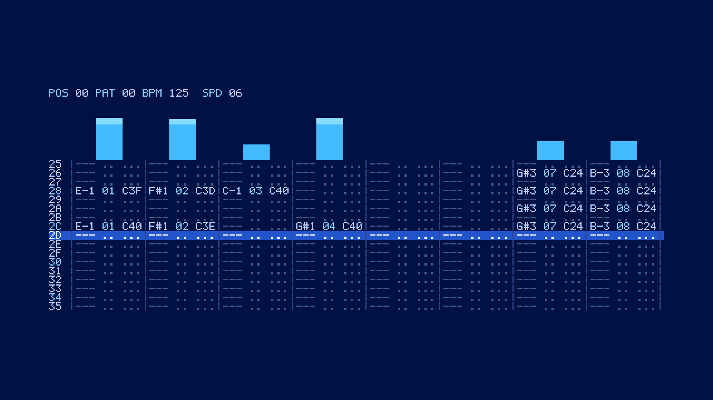
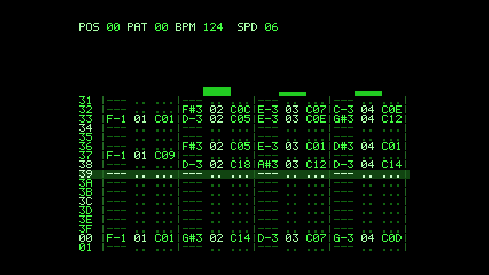

# pattern

> **AI-assisted project.** This codebase was created with [Claude](https://claude.com/claude-code)
> (Anthropic), directed and reviewed by a human author. Every claim below is
> *measured* by an offline harness that drives the real plugin class, and the
> ones that matter are measured with no GPU in the room: the row cursor sits on
> `floor( t / T ) mod 64` on **every one of 36,000 frames** of a ten-minute run
> from a host clock at 499 million milliseconds (`pntest --timing`); a burst in
> band *k* writes **exactly one** note, in channel *k*, on the row current at
> that frame (`--onset`); loud audio already playing when the clip starts writes
> **no false note** in its first second (`--prime`); a metronome, and drum
> grooves rendered as audio from 80 to 170 BPM, are detected to within
> **±1 BPM at the right metrical level in 4.0 s** (`--detected`, `--groove`).
> Each check carries a negative
> control that must fail, and one does. Every one of the 17 controls is proven to
> change the picture at two rasters, and the bundle registers, instantiates and
> lights pixels under the fleet's oxbow host. **It has never been loaded into
> Resolume on macOS**, and no real audio has reached it in a host: the release
> video was rendered by the harness from a synthesised track through the
> plugin's real audio input, and what that found is in the Status section.

A tracker's pattern editor, written by the music as it plays. An FFGL **source**
plugin for Resolume Arena and Avenue.

Four channels, 125 BPM, the harness's own drum loop. Rendered by the
plugin's offline harness (`pntest`), not captured from Resolume.

*[Watch it](https://www.youtube.com/watch?v=xsJ5pMAs9Ss) — 55 seconds, with
sound: one channel filling on a kick and bass, every channel filling as the band
comes in, the ring emptying three columns from the cursor down when the band
drops out, eight channels under the Log bin law on the blue theme, the Manual
tempo source at half the track's tempo, and Speed 3 with Keep Notes on the
green theme. Every frame is the real plugin's output: an FFGL plugin has no
window, so the footage is rendered by this repository's own offline harness
(`pntest --pipe`, driven by a cue sheet) rather than filmed off a screen, and
the soundtrack is a track synthesised for the video and fed to the plugin
through its real audio input, so what is heard is what wrote the pattern.*

<!-- downloads:start -->

## Download

**[v0.1.0](https://github.com/stoatworks-labs/pattern/releases/tag/v0.1.0)** — prebuilt for macOS and Windows. Pick your platform:

<b>macOS</b> — Universal (Apple Silicon + Intel)

| Build | Download | Size |
| --- | --- | --- |
| Universal (Apple Silicon + Intel) · .dmg disk image | [`pattern-0.1.0-macos-universal.dmg`](https://github.com/stoatworks-labs/pattern/releases/download/v0.1.0/pattern-0.1.0-macos-universal.dmg) | 230 KB |
| Universal (Apple Silicon + Intel) · .zip archive | [`pattern-macos-universal.zip`](https://github.com/stoatworks-labs/pattern/releases/latest/download/pattern-macos-universal.zip) | 190 KB |

<b>Windows</b> — x64

| Build | Download | Size |
| --- | --- | --- |
| x64 · .exe installer | [`pattern-0.1.0-windows-x86_64-setup.exe`](https://github.com/stoatworks-labs/pattern/releases/download/v0.1.0/pattern-0.1.0-windows-x86_64-setup.exe) | 224 KB |
| x64 · .zip archive | [`pattern-windows-x86_64.zip`](https://github.com/stoatworks-labs/pattern/releases/latest/download/pattern-windows-x86_64.zip) | 116 KB |

All builds, checksums and release notes: [github.com/stoatworks-labs/pattern/releases](https://github.com/stoatworks-labs/pattern/releases).

macOS builds are signed and notarised and open normally. The Windows builds are unsigned, so SmartScreen warns once.

<!-- downloads:end -->

## The one idea

A tracker plays a pattern of 64 rows. The rows advance at a rate set by two
numbers: **Speed** (ticks per row) and **BPM** (a tick lasts 2.5 / BPM seconds),
so at the default speed of 6 there are four rows to a beat. Each row holds one
note per channel: note, sample number, effect.

FFGL gives a plugin no audio output, only the spectrum of what is playing. So
this runs the tracker **backwards**: the row cursor runs on the real tracker
clock, and the music writes into the pattern. Each channel owns a band of the
host's 64-bin spectrum. An onset in that band writes a note into the channel on
the current row — its pitch from the band's spectral peak, its volume as a
`Cxx` effect from the onset's strength, its sample number from the channel.

### What falls out

- **The cursor steps on the beat**, four rows a beat at speed 6, because it runs
  on the tracker's own clock locked to the host's BPM. Nothing is animated.
- **The pattern fills as the track plays.** A busy passage fills every row; a
  sparse one leaves dots.
- **The ring.** After row `3F` the cursor wraps and the next pass overwrites the
  last. Fills repeat bar by bar, and a change in the arrangement shows up as the
  old notes being replaced — rows above the cursor are this pass, rows below it
  are the last.
- **VU bars per channel** set by each note's volume, falling one step every
  20 ms, the way a vblank-driven meter falls.

It is not a MOD player and it draws no logos or names. The themes are colour
schemes named by colour.

## Controls

- **Clock** — Tempo Source (Host / Detected / Manual), BPM (60–200, for
  Manual), Speed (1–31 ticks a row), Swing (delays odd rows by up to half a
  row), Rows (64 or 32), Keep Notes (a new pass does not clear a row).
- **Listening** — Channels (4 or 8), Bin Law (Linear / Log: how the 64 bins are
  laid out in frequency), Bin Value (Magnitude / Power), Sensitivity, Band Split
  (how the bins are divided between channels), Fold Octaves (a pitch outside
  C-1..B-3 is moved by octaves into it rather than shown as `---`).
- **Display** — Theme (Grey / Blue / Green), Rows Visible (3–33), Show VU, Show
  Effects, Scale (whole pixels per screen pixel; 0 is the largest that fits).

## What it reads, and what is assumed

Resolume gives an FFGL plugin one thing about the audio: a 64-bin spectrum, once
per frame, and its tempo through `SetBeatInfo`. Nobody in this fleet has
measured how those 64 bins are laid out in frequency, whether they are
magnitudes or powers, or what sample rate stands behind them. A level meter can
sidestep that (needle sums every bin); a pattern editor cannot, because a
*band* is a range of bins and a *pitch* is a bin's frequency. So the two
unknowns are controls — **Bin Law** and **Bin Value** — and the sample rate is
whatever the host's `SetSampleRate` says, 44.1 kHz when it never does. Under
Linear at 44.1 kHz only the first three bins fall inside a tracker's C-1..B-3,
which is why **Fold Octaves** is on by default: the note *name* is the pitch
class the band's peak has, and only the octave digit is a lie. Turn it off and
the pattern says `---` wherever the pitch is out of range, which is the honest
answer and a duller picture.

The clock is rate-locked to the host's tempo and free-running in phase: row 0 is
wherever the clip started, not the host's downbeat. FFGL 2.1 does hand over a
`barPhase`, but nothing here has measured how Resolume drives it, so it is not
used yet (see `AGENTS.md`).

## Status

**v0.1.1, released 2026-09-25, and honestly early.** v0.1.1 fixes the Detected
tempo source, which in v0.1.0 locked to half the real tempo on programme
material (62 for a 125 BPM groove); nothing else changed.

Verified, by measurement on this machine (Apple Silicon, macOS 26.4), with
`tools/verify.sh` green:

- **The clock.** The cursor is on `floor( 2 i BPM / ( 5 Speed fps ) ) mod Rows`,
  in exact integer arithmetic, on every frame of six ten-minute runs (36,000,
  30,000 and 18,000 frames at 60, 50 and 30 fps) from a host clock in
  milliseconds at 499,000,000 ms, with a swing of a quarter row, and from
  frame 0. A tempo change carries the phase across with no row jump. The phase
  kept in float fails on 2,400 of 36,000 frames.
- **Onsets.** Four and eight channels under both bin laws: every channel's burst
  writes its own cell, and exactly one cell in the pattern; a burst held across
  a row boundary writes once. A detector that fires on level rather than change
  writes two.
- **Frame one.** Stationary noise at 0.3 per bin already playing when the clip
  triggers, at 40 s and at 499,000,000 ms: no false note in the first second,
  and a real onset at 1.5 s is still heard. Unprimed, four false notes.
- **Pitch.** All 64 bins give the predicted note or `---` under Linear and Log,
  folded and unfolded; unfolded, Linear puts 3 bins in range and Log 19; a
  96 kHz sample rate moves the notes as predicted. One semitone sharp fails on
  64 of 64.
- **The ring.** Rows written on pass 0 only are cleared on pass 1 (3 of 3), kept
  with Keep Notes on, rows written on both carry pass 1's note, a jump of 520
  rows clears the pattern. A pass that never clears fails.
- **Detected tempo, on a metronome.** 120 BPM at 60 fps, 100 at 50, 150 at 60
  and 120 at 24 fps all within ±1 BPM by **4.00 s** and holding for twelve; the
  row clock follows it over a host saying 77. A lag scaled by 1.1 reads 109.08
  and never settles.
- **Detected tempo, on grooves** (`--groove`). Drum grooves rendered as audio
  and put through the harness's FFT — a backbeat (kick on 1 and 3, clap on 2
  and 4, hats on the eighths), the same with the clap 12 dB and the hats 20 dB
  down, a syncopated kick, and the video's syncopated pluck over a backbeat, at
  80, 90, 100, 110, 125, 140, 150, 160 and 170 BPM, plus the release video's
  house groove at 115–135 and four frame rates — all 45 read within ±1 BPM at
  the right metrical level by **4.00 s** and hold for sixteen, the worst error
  after settling 0.26 BPM. v0.1.0's detector, kept as the negative control,
  fails 15 of the 45 (160 for 80, 200 for 100, 62.1 for the video's 125). The
  release video's own soundtrack reads 124.5–125.0 at 30 fps and 60 fps from
  4 s to the end, where v0.1.0 read 62 and 100 at 30 fps.
- **The picture.** At 640×360 and 320×180, at Scale 1–4 and Auto, four and
  eight channels: every s×s block aligned to the plugin's origin is one colour
  (57,600 blocks at 640×360 Scale 1), every pixel outside the screen is the
  theme background, and the probed cells equal the font table bit for bit. A
  fractional scale fails on 576 glyph pixels; a one-row shift in the shader
  (the mutation test) fails 36 assertions.
- **No dead controls.** All 17 change the picture at 640×360 and at 320×180.
- **The pipe.** Three 64×36 frames are 27,648 bytes; a reader that hangs up
  gets exit status 1, not SIGPIPE's 141.
- **Cost**, `pntest --bench` (fastest of five passes of 200 frames, the drum
  loop playing, glFinish both sides): **0.041 ms at 1280×720, 0.054 ms at
  1920×1080, 0.128 ms at 3840×2160** — under one per cent of a 60 fps frame.
  Apple Silicon only; the CPU side is a few hundred multiply-adds a frame.
- The bundle is universal (`lipo`: x86_64 arm64), exports `plugMain`, ad-hoc
  signs, and probes under oxbow as **SW Pattern / PN01 / source / inputs 0..0**.

Not verified, and not pretended:

- **Never loaded into Resolume on macOS.** Everything above is the offline
  harness driving the real plugin class in a headless GL context. How 17
  controls in three groups present in the inspector there is untested.
- **No real audio has reached it in a host.** The 64 bins' layout, value law and
  sample rate are assumed (`Bin Law`, `Bin Value`, `SetSampleRate`), and the
  onset detector's thresholds were set on synthetic spectra and synthesised
  tracks, not on programme material through Resolume's FFT.
- **The harness has run on this Mac's GPU and on CI's software renderer**
  (`ci.yml`, green on the release commit); nothing has timed it elsewhere.
- **On Windows it has been loaded into Resolume**: a build of this source
  loads, registers as `SW Pattern` / `PN01` / source and renders in Resolume
  Arena 7.27.1 on software rendering (win-lab, Mesa llvmpipe, no GPU), with
  all 23 host controls matching the declaration and the five visual controls
  moving the picture — 9 of the fleet gate's 9 checks. The box has no sound
  device, so its 12 audio-driven controls were not exercised there, and the
  Manual BPM could not be shown moving on the gate's still.
- No factory presets and no OpenFX port. There is a [user
  guide](https://stoatworks-labs.com/software/pattern/guide/) and a [browser
  demo](https://pattern-demo.stoatworks-labs.com), which is a port rather than
  the plugin.

Found filming the release video, on a synthesised 125 BPM track through
`pntest --wav` (the harness's own FFT, not Resolume's):

- **A quiet band hears the leading edge of any sharp transient.** The detector
  reads the first frame that contains an onset, and the first milliseconds of
  a click are broadband, so a kick with a 1 ms attack wrote every channel until
  each band's floor had learned the leak (about a second). The 1e-4 absolute
  floor is far below such leakage. The video's instruments have soft attacks
  and steep filters for that reason; the guide says so.
- **A band holding a sustained instrument adapts to it.** With the bass under
  the kick in bin 0, the kick failed the ratio in its own band and the next
  band up wrote it from the leak, naming that band's peak bin.
- **The tempo detector read the bar, not the beat**, on the track: 62 for 125
  in three takes (100 on a syncopated cut). **Fixed in v0.1.1**: the raw summed
  flux let the kick outweigh the clap, so the envelope repeated at the half
  note. The detector now standardises three registers (low, mid, high) before
  summing, scores each period with its grouping and subdivision, and takes the
  fastest level that scores within 0.70 of the best; `AGENTS.md` has the
  account. The video (made with v0.1.0) still shows the Manual source instead.
- **What v0.1.1 still reads at the wrong level:** a breakbeat with ghost snares
  and sixteenth hats (double at 80, half from 140 to 170, unsettled at 125;
  right at 90–110), and a four-on-the-floor with an off-beat bass at 80 and 90
  (read as 160 and 180: its eighths are a real pulse at twice the tempo; right
  from 100 to 170). Both are measured by `--groove` and printed, not asserted.
  Use Host or Manual for such material.

## Browser demo

**<https://pattern-demo.stoatworks-labs.com>** — the plugin's own shader, copied
unedited into WebGL2, over a JavaScript port of its tracker (the row clock, the
ring, the onset and tempo detectors, the meters), its screen composer, layout,
palettes, parameter conversions and font. **There is no audio in the page**: a
pattern editor with no audio is an empty grid, so the page synthesises a 64-bin
spectrum itself — a drum-loop-like programme (kick, clap, a stab, hats) on its
own clock, nothing sampled — and hands the port the programme's tempo as a host
would through `SetBeatInfo`. That is the page's spectrum, not Resolume's FFT,
whose layout, value law and sample rate are unknown, and the onset thresholds
were set on synthetic spectra like it. Speed, Rows Visible and Scale are
dropdowns there because the demo kit has no integer control. The port is
checked by nobody but a reader; the shader copy is checked by
`demo/tools/check_shaders.py`, run by `tools/verify.sh`. See `demo/README.md`.

## Installing

Copy `Pattern.bundle` (macOS) or `Pattern.dll` (Windows) into

    ~/Documents/Resolume Arena/Extra Effects        (or "Resolume Avenue")
    Documents\Resolume Arena\Extra Effects           (Windows)

and restart Resolume. It appears under **Sources**.

## Building

    git clone --recursive https://github.com/stoatworks-labs/pattern
    cmake -B build -DCMAKE_BUILD_TYPE=Release
    cmake --build build
    cmake --install build          # into Arena's Extra Effects, macOS

The macOS build is universal (arm64 + x86_64) by default; add
`-DCMAKE_OSX_ARCHITECTURES=arm64` for a faster development build. Windows needs
GLEW from vcpkg — see `.github/workflows/release.yml` for the exact configure
line.

## Building and testing

The offline harness drives the real plugin class. Nine of its ten check groups
open **no GL context at all**, because the claims they make are claims about the
tracker's published state and a rasteriser has no opinion about those:

    ./build/pntest --timing        # the cursor, from a host clock at 499 million ms
    ./build/pntest --onset         # one note, right channel, right row, nowhere else
    ./build/pntest --prime         # frame one, with loud audio already playing
    ./build/pntest --pitch         # the bin law's note, both laws, folded and not
    ./build/pntest --ring          # the next pass overwrites, clears or keeps
    ./build/pntest --detected      # a metronome within +-1 BPM in 4 s
    ./build/pntest --groove        # drum grooves as audio, 80..170 BPM, the right metrical level
    ./build/pntest --grid          # and the one check that reads a rasteriser
    ./build/pntest --bench         # 720p through 4K
    ./build/pntest --out /tmp/f.png --size 1920x1080 --frames 300 --audio beats --host-bpm 125
    python3 tools/sweep.py         # no control is silently dead
    tools/verify.sh                # all of it, in about a minute

For video, `--pipe` writes raw RGBA frames to stdout, driven by a cue script and
by audio that reaches the plugin **through its real audio input**: a synthetic
preset (`--audio beats|metronome|tone:N|noise|sweep`), a WAV file through a
2048-point FFT folded into 64 bins (`--wav track.wav`), or macroblock's
one-line-per-frame spectrum file (`--spectrum bins.txt`):

    ./build/pntest --pipe --size 1920x1080 --fps 60 --wav track.wav --host-bpm 124 \
      --script cues.txt | ffmpeg -f rawvideo -pix_fmt rgba -s 1920x1080 -r 60 -i - out.mov

A cue script is `frame  Parameter Name  value` lines; `Host BPM` and `Bin 0`..
`Bin 63` are accepted there too.

## Diagnostics

pattern writes a plain-text log every time it runs:

    ~/Library/Logs/pattern/pattern.YYYY-MM-DD.log                        (macOS)
    %LOCALAPPDATA%\pattern\logs\pattern.YYYY-MM-DD.log                   (Windows)
    ${XDG_STATE_HOME:-~/.local/state}/pattern/logs/pattern.YYYY-MM-DD.log

It records the build, the GL driver, what unit the host's clock turned out to
be, whether any audio reached the layer, and which tempo the clock is following
— the first two of which are the commonest reasons a pattern never fills.

<!-- attributions:start -->
This project is built on other people's work — see [ATTRIBUTIONS.md](ATTRIBUTIONS.md).
<!-- attributions:end -->

## Licence

MIT. See [LICENSE](LICENSE).

The tracker conventions this follows — 64 rows, a tick of 2.5 / BPM seconds,
Speed ticks a row, hex row numbers, `C-1` to `B-3`, a `Cxx` volume effect — are
the genre's public arithmetic, not anybody's source. No code, font, screen
layout or asset was taken from any tracker, and none is named on screen.
